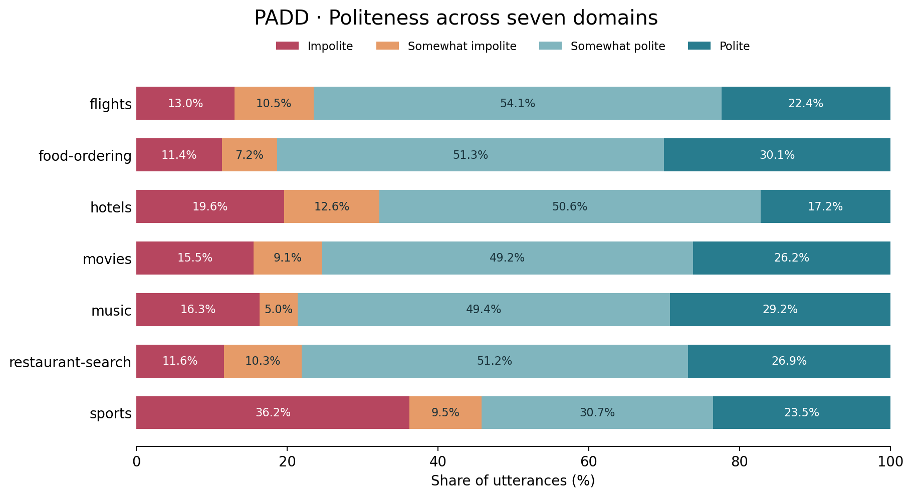

# GenPADS · Polite, adaptive dialogue

Code and data for **[GenPADS: Reinforcing politeness in an end-to-end dialogue system](https://doi.org/10.1371/journal.pone.0278323)**.

**Kshitij Mishra · Mauajama Firdaus · Asif Ekbal**

Indian Institute of Technology Patna · *PLOS ONE*, 18(1), 2023

[Paper](https://journals.plos.org/plosone/article?id=10.1371/journal.pone.0278323) · [Datasets](datasets/README.md) · [Method](docs/method.md) · [Results](docs/results.md) · [BibTeX](CITATION.bib)

GenPADS extends PADS with a response generator, combining politeness
classification with a dialogue policy. The policy selects what to say; the generator expresses that action
in natural language; politeness feedback helps the policy adapt its next action.
The system covers seven task-oriented domains from Taskmaster-2.

## Dataset

The release contains **341,801 utterances across 17,289 conversation IDs**.
PADD supplies four-class politeness targets. GenDD supplies cleaned turns,
user-to-agent pairs for the dialogue generator (DG), and agent-to-agent pairs
for the response generator (G).

| Domain | PADD utterances | Cleaned turns | DG pairs | G pairs |
| --- | ---: | ---: | ---: | ---: |
| Flights | 63,346 | 28,961 | 8,003 | 16,006 |
| Food ordering | 13,953 | 6,556 | 2,076 | 4,152 |
| Hotels | 63,048 | 27,299 | 6,373 | 12,746 |
| Movies | 59,757 | 25,551 | 8,274 | 16,548 |
| Music | 26,912 | 12,475 | 4,085 | 8,170 |
| Restaurant search | 66,205 | 25,708 | 7,089 | 14,178 |
| Sports | 48,580 | 26,118 | 9,532 | 19,064 |
| **Total** | **341,801** | **152,668** | **45,432** | **90,864** |

These are counts of the released CSV records. Each DG row is one user/agent
pair, and each G row is one input/target pair. The [dataset guide](datasets/README.md)
provides schemas, split statistics and the comparison with the paper's counts.

| Label | Meaning | Global share |
| ---: | --- | ---: |
| 0 | Impolite | 17.9% |
| 1 | Somewhat impolite | 9.9% |
| 2 | Somewhat polite | 48.2% |
| 3 | Polite | 24.0% |

Shares are computed from the released records. The [dataset guide](datasets/README.md)
compares them with the paper's distribution.



Data files are regular UTF-8 CSVs:

```text
datasets/
├── padd/<domain>.csv           # Utterances and politeness labels
├── gendd/cleaned/<domain>.csv  # Turns and slot information
├── gendd/dg/<domain>.csv       # User → agent response pairs
├── gendd/g/<domain>.csv        # Agent response → response variants
├── labels.json                # Four class IDs and names
└── manifest.json              # Counts, splits and SHA-256 checksums
```

Every CSV contains a `split` column: `train`, `validation` or `test`.
Partitions use approximately 80%/10%/10% of conversation IDs with seed 42.
All turns and generation examples from a conversation stay together;
conversations sharing a G-module input (agent response) within a domain also
stay together.

```python
from genpads.data import load_rows

rows = load_rows("datasets/padd/flights.csv", split="train")
print(rows[0]["text"], rows[0]["label"])

pairs = load_rows("datasets/gendd/dg/flights.csv", split="validation")
print(pairs[0]["input_text"], pairs[0]["target_text"])
```

## Quick start

Use Python 3.10 or newer. Python 3.11 is used for validation and CI.

```bash
git clone git@github.com:Mishrakshitij/GenPADS.git
cd GenPADS
python3.11 -m venv .venv
source .venv/bin/activate
python -m pip install -e .
python -m genpads verify-data
python -m genpads simulate --domain flights --episodes 100
```

The last command runs a seeded slot-filling sanity check using templates.
Training and learned response generation use the optional model dependencies:

```bash
python -m pip install -e '.[train]'
```

Base models download on first use. `--model-name` also accepts a local model
directory. A CUDA GPU is recommended for BART-large; smaller models and CPU
execution can be selected for development.

## Train the models

Train one classifier and generator per domain. Replace `flights` with any
domain name from the dataset folders.

```bash
# Politeness classifier: DistilBERT, four classes
python -m genpads train --task pc --domain flights \
  --output checkpoints/flights-pc

# Dialogue generator: BART, user utterance → agent response
python -m genpads train --task dg --domain flights \
  --output checkpoints/flights-dg

# Generation module: BART, action response → response variant
python -m genpads train --task g --domain flights \
  --output checkpoints/flights-g
```

Defaults are DistilBERT-base for PC and BART-large for DG/G, AdamW with learning
rate `4e-5`, and sequence length 128. PC trains for two epochs; DG/G train for
six. Each command evaluates the validation split and saves the checkpoint with
the lowest validation loss. Use `--batch-size`, `--accumulation-steps`,
`--epochs`, `--device` and `--max-steps` to control a run.

## Train and evaluate the dialogue policy

The dialogue manager uses a 32-unit LSTM with REINFORCE and AdaDelta.
Choose `baseline` or `prrp` rewards. PRRP includes politeness feedback and a
penalty for requesting an already supplied slot.

```bash
python -m genpads train-policy --domain flights --reward-mode prrp \
  --classifier checkpoints/flights-pc --generator checkpoints/flights-g \
  --episodes 8000 --evaluate-every 400 --evaluation-episodes 500 \
  --device cuda --output checkpoints/flights-policy

python -m genpads simulate --domain flights --episodes 500 \
  --policy checkpoints/flights-policy \
  --classifier checkpoints/flights-pc --generator checkpoints/flights-g \
  --device cuda
```

The generator samples responses, and the classifier scores the text actually
emitted. Evaluation reports task success, dialogue length, reward and politeness.
Omit `--generator` to run RetrievalPADS with action templates. Omitting both
learned modules uses the template styles for the simulator's feedback.
Run outputs identify the active response and scoring modes.

```bash
python -m genpads classify --checkpoint checkpoints/flights-pc \
  --text "Could you please share your departure city?"
python -m genpads generate --checkpoint checkpoints/flights-g --sample \
  --text "Please tell me your departure city."
python -m genpads evaluate --checkpoint checkpoints/flights-pc
python -m genpads evaluate --checkpoint checkpoints/flights-g
```

Classifier evaluation includes accuracy and macro F1. Generator evaluation
includes response-token loss and perplexity. For BLEU, NIST, METEOR and ROUGE-2:

```bash
python -m pip install -e '.[metrics]'
python -m nltk.downloader wordnet omw-1.4
python -m genpads evaluate --checkpoint checkpoints/flights-g --text-metrics
```

## Results reported in the paper

| Domain | GenPADS baseline success | GenPADS PRRP success | PC F1 |
| --- | ---: | ---: | ---: |
| Flights | 67% | **79%** | 0.92 |
| Food ordering | 69% | **86%** | 0.96 |
| Hotels | 74% | **82%** | 0.94 |
| Movies | 77% | **84%** | 0.95 |
| Music | 71% | **86%** | 0.93 |
| Restaurant search | 79% | **82%** | 0.95 |
| Sports | 64% | **81%** | 0.92 |

These are published experimental results. The [method notes](docs/method.md)
describe this implementation and its configuration choices; [results and
validation](docs/results.md) distinguish the paper's experiments from checks
performed on the released code. Trained paper checkpoints are not included.

## Repository layout

```text
GenPADS/
├── datasets/       # All seven domains, label map and statistics
├── src/genpads/    # Data loaders, PC/DG/G models, policy and CLI
├── tests/          # Dataset, numerical and small-model checks
├── scripts/        # Dataset verification and figure generation
├── docs/           # Method, paper results and figures
├── licenses/       # Dataset source attribution and terms
├── CITATION.bib
└── CITATION.cff
```

```bash
python -m pip install -e '.[test,figures]'
python -m unittest discover -s tests -v
python scripts/plot_dataset.py
```

## Citation

```bibtex
@article{mishra2023genpads,
  title = {GenPADS: Reinforcing politeness in an end-to-end dialogue system},
  author = {Mishra, Kshitij and Firdaus, Mauajama and Ekbal, Asif},
  journal = {PLOS ONE},
  volume = {18},
  number = {1},
  pages = {e0278323},
  year = {2023},
  doi = {10.1371/journal.pone.0278323}
}
```

The dialogue text comes from [Taskmaster-2](https://github.com/google-research-datasets/Taskmaster/tree/master/TM-2-2020).
Please also cite the Taskmaster reference in [CITATION.bib](CITATION.bib).
Dataset attribution and terms are provided in [licenses/](licenses/README.md).
