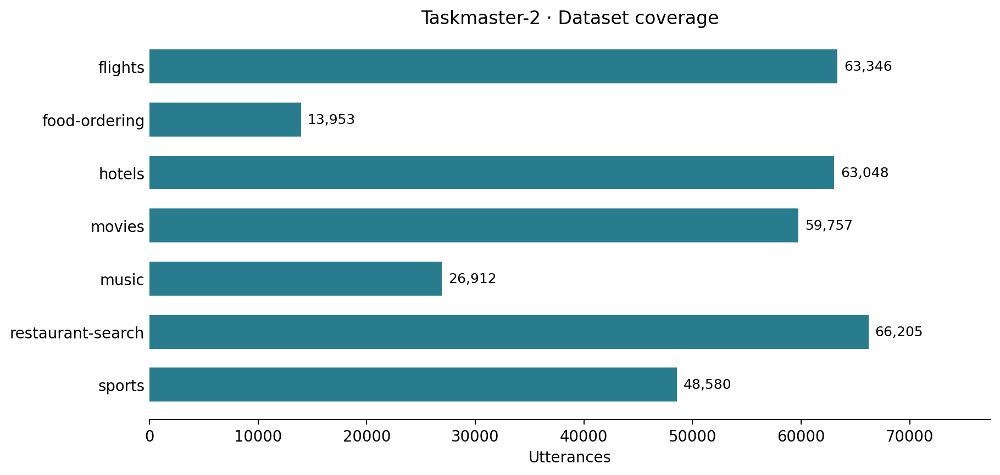

# Datasets

PADD and GenDD cover the seven Taskmaster-2 domains. The release contains 341,801 utterance records, 152,668 cleaned turns, 45,432 dialogue pairs and 90,864 generator pairs. Files are UTF-8 CSVs; no archive extraction is needed.

## Files and fields

| Path | Fields |
| --- | --- |
| `padd/<domain>.csv` | `conversation_id`, `utterance_id`, `speaker`, `text`, `label`, `split` |
| `gendd/cleaned/<domain>.csv` | `conversation_id`, `utterance_id`, `turn_id`, `speaker`, `text`, `segments`, `split` |
| `gendd/dg/<domain>.csv` | `conversation_id`, `example_id`, `input_text`, `target_text`, `split` |
| `gendd/g/<domain>.csv` | `conversation_id`, `example_id`, `source_id`, `input_text`, `target_text`, `split` |

`speaker` is `USER` or `ASSISTANT`. IDs retain conversation lineage. The `segments` field is a JSON list of the source slot spans and their names; `turn_id` is the source turn index. In DG, `input_text` is a user turn and `target_text` is the following agent response. In G, `source_id` points to the DG example and `input_text` equals that example's agent response. Each DG example has two G target records.

`labels.json` maps the four integer IDs to class names. `manifest.json` records every CSV's columns, row and conversation counts, split sizes and SHA-256 checksum.

## Domain counts

| Domain | Conversation IDs | PADD | Cleaned | DG pairs | G pairs |
| --- | ---: | ---: | ---: | ---: | ---: |
| flights | 2,481 | 63,346 | 28,961 | 8,003 | 16,006 |
| food-ordering | 1,050 | 13,953 | 6,556 | 2,076 | 4,152 |
| hotels | 2,355 | 63,048 | 27,299 | 6,373 | 12,746 |
| movies | 3,047 | 59,757 | 25,551 | 8,274 | 16,548 |
| music | 1,602 | 26,912 | 12,475 | 4,085 | 8,170 |
| restaurant-search | 3,276 | 66,205 | 25,708 | 7,089 | 14,178 |
| sports | 3,478 | 48,580 | 26,118 | 9,532 | 19,064 |



The source includes 17,304 dialogue records sharing 17,289 conversation IDs. Fifteen IDs occur twice with alternate source records. Those records remain together, and occurrence suffixes make their utterance and example IDs unique.

## Politeness labels

| Label | Class | Utterances | Share |
| ---: | --- | ---: | ---: |
| 0 | Impolite | 61,183 | 17.9% |
| 1 | Somewhat impolite | 33,837 | 9.9% |
| 2 | Somewhat polite | 164,829 | 48.2% |
| 3 | Polite | 81,952 | 24.0% |

Figure 2 of the paper reports 17.9%, 9.9%, 47.8% and 24.4%. The table above reports the released records; its class shares differ from that reference. Per-domain counts are:

| Domain | 0 | 1 | 2 | 3 |
| --- | ---: | ---: | ---: | ---: |
| flights | 8,226 | 6,653 | 34,283 | 14,184 |
| food-ordering | 1,589 | 1,011 | 7,160 | 4,193 |
| hotels | 12,373 | 7,929 | 31,889 | 10,857 |
| movies | 9,290 | 5,442 | 29,375 | 15,650 |
| music | 4,399 | 1,351 | 13,303 | 7,859 |
| restaurant-search | 7,700 | 6,822 | 33,897 | 17,786 |
| sports | 17,606 | 4,629 | 14,922 | 11,423 |


## Partitions

Each row has a `train`, `validation` or `test` split. Approximately 80%/10%/10% of conversation IDs are assigned to those partitions with seed 42. A conversation has the same split in PADD and every GenDD file. Within each domain, conversations sharing a G input (an agent response, compared after case folding and whitespace normalization) are grouped together. G targets and their source DG examples therefore stay in the same partition.

Common user phrases may occur in different conversations and partitions. The split separates conversation IDs and G inputs; it does not require every PADD utterance string or DG user input to be unique across partitions.

| Domain | PADD train / validation / test | DG train / validation / test | G train / validation / test |
| --- | --- | --- | --- |
| flights | 50,687 / 6,325 / 6,334 | 6,500 / 755 / 748 | 13,000 / 1,510 / 1,496 |
| food-ordering | 11,189 / 1,360 / 1,404 | 1,675 / 195 / 206 | 3,350 / 390 / 412 |
| hotels | 50,558 / 6,328 / 6,162 | 5,168 / 653 / 552 | 10,336 / 1,306 / 1,104 |
| movies | 47,776 / 5,930 / 6,051 | 6,667 / 829 / 778 | 13,334 / 1,658 / 1,556 |
| music | 21,487 / 2,686 / 2,739 | 3,257 / 426 / 402 | 6,514 / 852 / 804 |
| restaurant-search | 53,242 / 6,703 / 6,260 | 5,788 / 671 / 630 | 11,576 / 1,342 / 1,260 |
| sports | 38,787 / 4,905 / 4,888 | 7,732 / 911 / 889 | 15,464 / 1,822 / 1,778 |

## Generator target statistics

G contains two target records per source example. Targets can repeat or equal their input. The table reports these cases explicitly; two records do not imply two distinct rewrites.

| Domain | Target rows | Targets equal to input | Distinct input/target pairs | Distinct changed pairs |
| --- | ---: | ---: | ---: | ---: |
| flights | 16,006 | 182 | 15,203 | 15,067 |
| food-ordering | 4,152 | 26 | 3,644 | 3,622 |
| hotels | 12,746 | 151 | 12,416 | 12,300 |
| movies | 16,548 | 489 | 15,951 | 15,603 |
| music | 8,170 | 643 | 8,028 | 7,471 |
| restaurant-search | 14,178 | 307 | 13,610 | 13,383 |
| sports | 19,064 | 1,108 | 17,754 | 17,160 |

## Relationship to the paper's counts

Table 1 of the paper reports 341,807 PADD utterances; the available Taskmaster-2 source has 341,801. Flights agrees exactly, and each other domain has one fewer source utterance. The release retains the available records.

The released cleaned data contains 152,668 turns with source slot spans, compared with 152,663 in the paper. DG pairs remain inside their conversation and join adjacent turns from the same speaker with spaces. These counts are 45,432 pairs for DG and two target records per pair for G. The paper lists 91,072 under DG and 45,536 under G, while its supplied food-ordering DG file contains 2,077 pairs; its generation columns therefore do not consistently count paired CSV rows. The tables above use one CSV row as one pair throughout.

## Loading and checking

```python
from genpads.data import load_rows

rows = load_rows("datasets/padd/flights.csv", split="train")
pairs = load_rows("datasets/gendd/g/flights.csv", split="test")
```

```bash
python -m genpads verify-data
```

The verifier checks file hashes, required fields, row and label counts, unique record IDs, conversation partitions, cleaned-turn lineage, G-input separation and the two-target link from DG to G.

Dialogue source attribution and terms are in [licenses/](../licenses/README.md).
